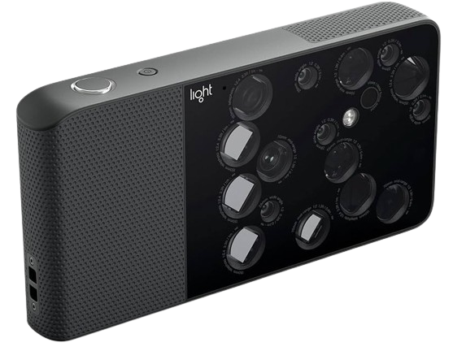

In early 2018, Light.co released a groundbreaking camera. It was claimed to be engineering marvel. It takes 16 different images and using [computational photogrammetry](https://www.asprs.org/wp-content/uploads/pers/1970journal/jun/1970_jun_567-569.pdf) combines the 16 different images into one. Unfortunately the cameras software was badly executed. In this blog post, we will think of ways to re-engineer the device and try to recreate the software using the same methods.

All this work, wouldn't be possible without [gennyble](https://github.com/gennyble) and all the members in light.co discord server.

## How it works under the hood ?

L16 simulates all the focal lengths in between 28mm, 70mm, and 150mm by combining data from multiple camera modules. So instead of digitally zooming in on the 28mm image to make it look like it was shot at 40mm, it’s replicating that focal length by stitching images together on the fly. 

    

Since the company was acquired by John Deere, all the support for the device is non existant. We will have to understand all the basic parts of all the software by re-engineering every aspect of it. 

We have mainly three parts which we will have to figure out. These include:
* Lumen Software used for merging
* Raw file generated [[light/lri|.LRI ]]
* Camera APK and C++ Files

Since, this is a very engineering heavy project and relies on a lot of people. We have the following subpages, to better understand terms and files. Please click on each link to view. 
* [[light/ransac|RanSAC]]
* Foward Matrix and Color Matrix
* Illuminant type 
* De-Mosaic
* [[light/sift|SIFT]]
* ProtoBuff
* Gamma 
* [[bayer|Bayer Jpeg]]
* [[light/vignetting|Vignetting characterization]]
* [[light/tof|ToFCalibration]]
* TiFF files
* [[light/10bit|10 Bit Images]]

## Detailed Steps to be completed

### Raw file creation

The current process deals with **.lri** format. In the future, each individual image needs to be converted to **.RAW** format image which can be editied

### Stiching 

The whole stiching pipeline involves a lot of stages these are:

#### Enhance Feature Matching:

* **Preprocess images** to enhance features: Applying filters like edge enhancement can make feature points more distinct.
* **Tweak feature detection parameters**: If using custom stitching algorithms (beyond OpenCV's built-in Stitcher), adjusting parameters of feature detectors (e.g., SIFT, SURF) may yield better matches.

#### Improve Alignment:

* **Manual alignment**: For a small number of images, manually selecting matching points can improve the homography estimation.
* **RANSAC for Homography Estimation**: Ensure the RANSAC (Random Sample Consensus) algorithm is used to find the best homography matrix that aligns images. It's robust against outliers.

#### Seam Correction:

* **Seam finding algorithms**: Utilize seam finding and blending algorithms to minimize visible seams. OpenCV offers functions like createMultiBandBlender() which might produce better results than the default blending options in the Stitcher class.
* **Manual editing**: In cases where automated solutions fail, manual editing in photo editing software might be necessary to correct mismatches or blend seams.

#### Exposure and Color Correction:

* **Adjust exposure and color balance**: Before stitching, adjust the images to match in terms of exposure and color balance to reduce visual discrepancies.
* **Apply gain compensation**: Some stitching libraries offer gain compensation to equalize the brightness and color across stitched images.

#### Advanced Techniques and research:

* **Homography refinement**: After an initial stitch, refine the homography matrices by minimizing the discrepancy between the overlapping areas.
* **Multi-scale stitching**: Perform stitching at multiple scales or resolutions to ensure both large structures and fine details are well aligned.
