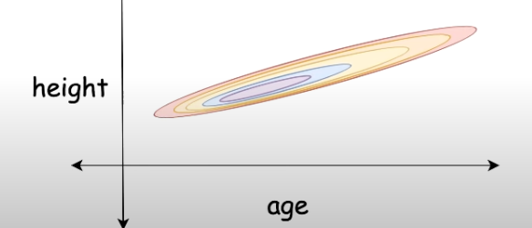
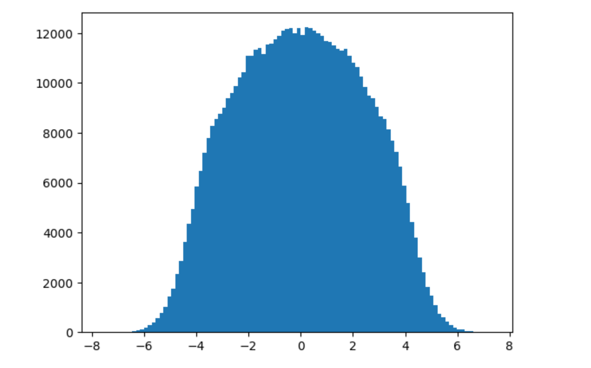
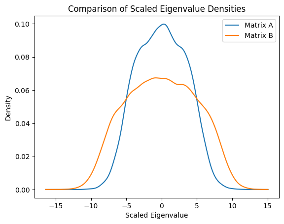
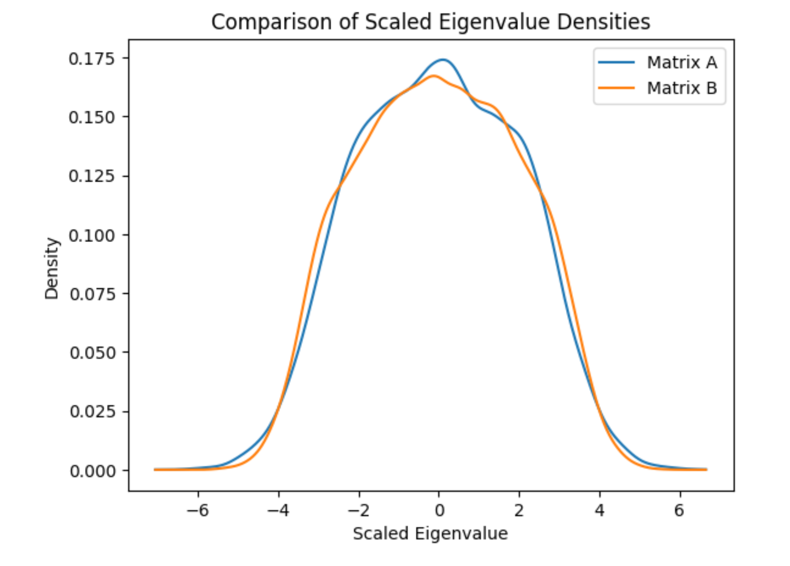
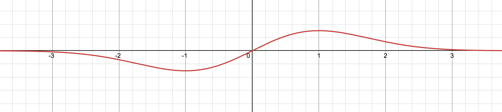

# Linear Algebra study

In this webpage, i will be writing notes about my linear algebra study. 

## Introduction of Random Matrix Theory

Random matrix theory is a branch of mathematical physics that studies the statistical properties of matrices. The theory is motivated by the observation that the eigenvalues of large random matrices often exhibit universal statistical behavior. This behavior is independent of the specific details of the matrix, such as its size, shape, or the distribution of its entries. Instead, the statistical properties of the eigenvalues depend only on the symmetry class of the matrix, which is determined by its symmetry properties.


#### Books

The book i am using is [Introduction of Random Matrices by Giacomo Livan, Marcel Novaes, Pierpaolo Vivo](https://arxiv.org/pdf/1712.07903.pdf)


There are couple of other books. But those are hard to understand. The include:
* [A First Course in Random Matrix Theory
for Physicists, Engineers and Data Scientists by Potters and Bouchard ](https://www.cambridge.org/core/books/first-course-in-random-matrix-theory/2292A554A9BB9E2A4697C35BCE920304) 

    - Special thanks to [@Cider](https://twitter.com/jeffreycider) for recommending this 

* [An Introduction to Random Matrices](https://www.wisdom.weizmann.ac.il/~zeitouni/cupbook.pdf)


#### Youtube Videos 

* [Random Matrices in Unexpected Places: Atomic Nuclei, Chaotic Billiards, Riemann Zeta #SoME2](https://www.youtube.com/watch?v=Y4mnlIvVJEs&t=519s&ab_channel=%E2%84%8Fistas)

* [Random Matrices: Theory and Practice - Lecture 1](https://www.youtube.com/watch?v=Je4bU3g_QGk&t=4s&ab_channel=ICTPCondensedMatterandStatisticalPhysics)


## Dig Deep

#### Definitions

##### Complex matrix

All real numbers are usually written as $A + Bi$, the same way matrix can be written as $A + Bi$ where A and B are matrices.

Example:

$$
\begin{bmatrix}
6 & 2+3i \\
18-2i & 4i
\end{bmatrix}
 = {
\begin{bmatrix}
6 & 2 \\
18 & 0
\end{bmatrix}
 } + 
\begin{bmatrix}
0 & 3 \\
-2 & 4
\end{bmatrix}
 $$

##### Hermitian matrix

A matrix is Hermitian if it is equal to its own conjugate transpose. In other words, a matrix $A$ is Hermitian if $A = A^H$. [Proof here](https://math.stackexchange.com/questions/764187/hermitian-matrix-with-their-eigenvalues-arranged-in-non-decreasing-order)

Also remember that $$\lambda _1 \geq \lambda _2 \geq \cdots \geq \lambda _n $$ 


Example:

$$ 
\begin{bmatrix}
2 & 1-i \\
1+i & 3
\end{bmatrix}
  => {
\begin{bmatrix}
2 & 1-i \\
1+i & 3
\end{bmatrix}
 }  => 
\begin{bmatrix}
2 & 1-i \\
1+i & 3
\end{bmatrix}
 $$

##### Gaussian Orthogonal Ensemble (GOE)


- **Symmetry**: Real symmetric matrices. This means that the matrix is equal to its transpose ($A = A^T$), and all elements are real numbers.
- **Key Property**: The matrices are invariant under orthogonal transformations. If $O$ is an orthogonal matrix ($OO^T = I$), then $OAO^T$ is also in the GOE if $A$ is.
- **Applications**: Models real symmetric systems with time-reversal symmetry, such as certain Hamiltonians in physics.

##### Gaussian Unitary Ensemble (GUE)

- **Symmetry**: Complex Hermitian matrices. This means the matrix is equal to its conjugate transpose ($A = A^\dagger$), with complex entries.
- **Key Property**: The matrices are invariant under unitary transformations. If $U$ is a unitary matrix ($UU^\dagger = I$), then $UAU^\dagger$ is also in the GUE if $A$ is.
- **Applications**: Used to model systems without time-reversal symmetry, which is common in quantum mechanics for systems experiencing a magnetic field.

##### Gaussian Symplectic Ensemble (GSE)

- **Symmetry**: Self-dual quaternion matrices, which can be thought of as a generalization involving quaternions, a type of hypercomplex number.
- **Key Property**: The matrices are invariant under symplectic transformations. This ensemble captures the properties of systems with a specific kind of time-reversal symmetry and spin-orbit interaction.
- **Applications**: Models systems that have both time-reversal symmetry and strong spin-orbit interaction effects, which are less common but relevant in certain areas of condensed matter physics.

###### Key Differences

- **Mathematical Structure**: The primary difference lies in the mathematical structure of the matrices (real vs. complex vs. quaternion) and their symmetry properties (orthogonal vs. unitary vs. symplectic).
- **Physical Applications**: Each ensemble is suited to model different physical systems based on their symmetry properties—GOE for real symmetric systems with time-reversal symmetry, GUE for complex Hermitian systems without time-reversal symmetry, and GSE for systems with peculiar time-reversal symmetry and spin interactions.
- **Statistical Properties**: The level spacing distributions (the distribution of distances between adjacent eigenvalues) differ among the three, reflecting the underlying symmetries and interactions in the modeled physical systems.

Learn about quaternions:  [[quaterion|Quaterions and its applications]]


#### Study

We have a way to generate random standard normal matrix which is symmetric. The code is as follows:

```
import numpy as np

def random_standard_normal_matrix(m,n):
    A = np.random.normal(0, 1, size=(m, n))
    return  np.tril(A) + np.triu(A.T, 1)
```

To get the eigenvalues of the matrix, we can use the following code:

```
from numpy.linalg import eig,eigvals

eigvals(A)
```

Since, these are random matrices, we can generate multiple matrices and then calculate all the stats of these matrices. This is refered to as an ensemble of matrices.

Generating the eigenvalues of 100000 matrices of size 3x3:

```
eigen = []
for i in range(100000):
    eigen += list(eigvals(random_standard_normal_matrix(3,3)))
```
Plotting the distribution of the standard normal matrix, we get this.




Now, you can see something intresting here. We have $N( \mu, \sigma^2)$ distribution for this new distributions of eigen values.

 This is called the Wigner's semi-circle law. The eigenvalues of a random matrix are distributed in a semi-circle. This is a very important property of the eigenvalues of a random matrix.

 Another important part is how do we compare two ensembles of matrices. This is done by calculating the graph above. But there is a problem. That is for $3 \times 3$ matrix. If we increase the size of the matrix $6 \times 6$, the graph will look different for the same distribution with the same mean and variance we get a wider graph 
 

To normalize this: we run the following code:
```
import numpy as np
import matplotlib.pyplot as plt
from scipy.stats import gaussian_kde


# Use Gaussian KDE to estimate the density of the scaled eigenvalues
density_A = gaussian_kde(np.real(eigen1))
density_B = gaussian_kde(np.real(eigen2))

# Plot the densities
x = np.linspace(min(np.real(eigen1).min(), np.real(eigen2).min()), 
                max(np.real(eigen1).max(), np.real(eigen2).max()), 1000)
plt.plot(x, density_A(x), label='Matrix A')
plt.plot(x, density_B(x), label='Matrix B')
plt.legend()
plt.xlabel('Scaled Eigenvalue')
plt.ylabel('Density')
plt.title('Comparison of Scaled Eigenvalue Densities')
plt.show()
```


Before Normalization




After Normalization 




Learn, the JPDF better here: [[jpdf | Joint Probability Density Function (JPDF) for Random Matrices]]


There is an another intresting conclusion

###### Wigner's Surmise

Probability of sampling two eigenvalues ’very close’ to each other (s → 0) is very small. This delta for any two eigenvalues can be calculated by
$$\frac{s}{2}e^{-\frac{s^2}{4}}$$ 

Visual representation of this is as follows:


take a more detailed view [[wigersurmise|Wigner's Surmise]]


The important (generic) feature is that the eigen vectors are not independent: their jpdf does not in general
factorize. The most striking incarnation of this property is the so-called level repulsion (as in Wigner’s
surmise): the eigenvalues of random matrices generically repel each other, while independent variables do
not have this property. This is a very important property of the eigenvalues of a random matrix.

For the standard normal $R^3$ we get these correlation values:
$$ 
\begin{bmatrix}
1 & -0.5988 &  -0.6256\\
-0.59881399 & 1. & 0.43375837 \\
-0.62568476 & 0.43375837 & 1. 
\end{bmatrix}
$$ 

Which shows these are correlated.
 

